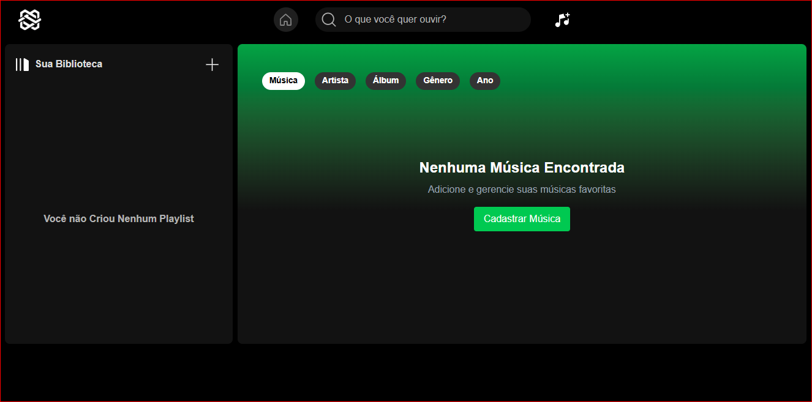

   
  <h1 align="center">Gerenciador de Musicas</h1>

 

# Sobre o projeto
### Um sistema completo de gerenciamento de músicas, onde os usuários podem cadastrar, organizar e criar playlists personalizadas. O projeto permite a busca e organização por critérios diversos, como artista, álbum e gênero, além de possibilitar a reprodução de músicas e a criação de filas de reprodução. Ideal para quem busca uma experiência prática e intuitiva para gerenciar suas músicas favoritas de forma eficiente e personalizada.
## Layout 

## Front-end:
- React.js
- Vite
- Tailwind CSS
- Axios
- TypeScript

## Back-end:
- Java (Spring Boot)

# Autor
## @Duck.Web

<!-- INSTAGRAM -->

